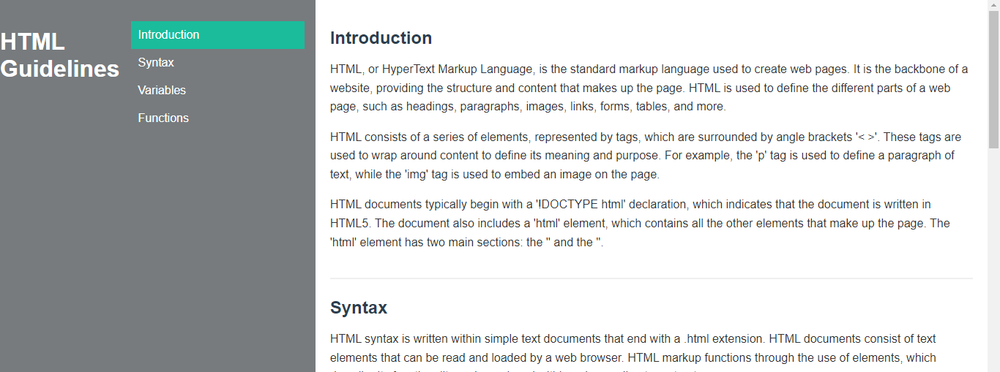

## Technical documentation of HTML
<h3>Description</h3>
<ul>
  <li>Beginner's guide on HTML language with syntax, variables, and soon the function</li>
  <li>Responsive website using HTML5 and CSS3 that is easy to navigate </li>
  <li>Color scheme: $\color{grey}{\textsf{D3D7D9}}$ $\color{white}{\textsf{FFFFFF}}$ $\color{aqua}{\textsf{1ABC9C}}$ 
</li>
</ul>
 

